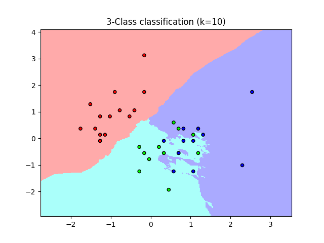
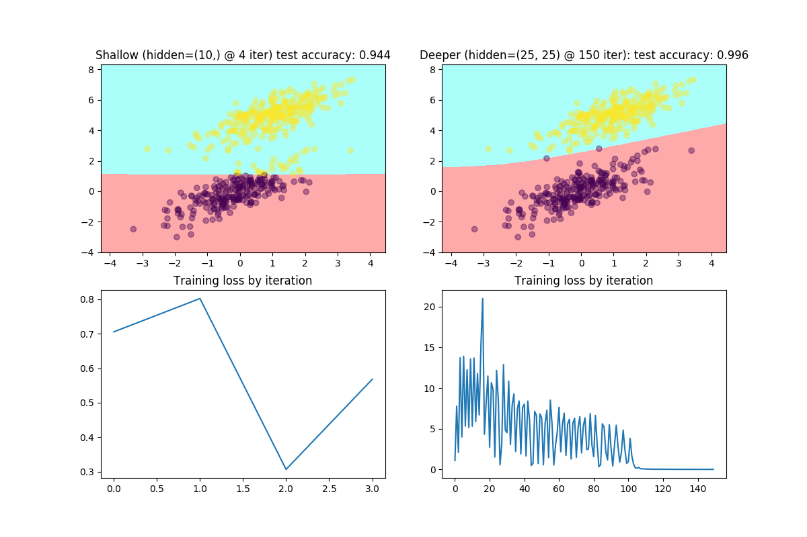

[](https://travis-ci.org/tgsmith61591/Hands-on-Supervised-Machine-Learning-with-Python)
[](https://ci.appveyor.com/project/tgsmith61591/hands-on-supervised-machine-learning-with-python/branch/master)
[](https://codecov.io/gh/tgsmith61591/Hands-on-Supervised-Machine-Learning-with-Python)


# Hands-on-Supervised-Machine-Learning-with-Python

Published by Packt, Hands-on Supervised Machine Learning with Python

### Learn the underpinning os many supervised learning algorithms, and develop rich python coding practices in the process.

*Supervised learning&mdash;help teach a machine to think for itself!*

## Overview

These days machine learning is everywhere, and it’s here to stay. Understanding the core principles that drive how a machine “learns” is a critical skill for any would-be practitioner or consumer alike. This course will introduce you to supervised machine learning, guiding you through the implementation and nuances of many popular machine learning algorithms while facilitating a deep understanding along the way.

In this course, we’ll cover parametric models such as linear and logistic regression, non-parametric methods such as decision trees & various clustering techniques, and we’ll wrap up with a brief foray into neural networks.

This video course highlights clean coding techniques, object-oriented class design, and general best practices in machine learning

## Target audience

This course is designed for those who would like to understand supervised machine learning algorithms at a deeper level. If you’re interested in understanding how and why an algorithm works rather than simply how to call its API, this course might be for you. Intermediate Python knowledge and at least an intermediate understanding of mathematical concepts is assumed. While notions in this course will be broken down into bits as granular as absolutely possible, terms and ideas such as “matrix transposition,” “gradient,” “dot product,” and “time complexity” are assumed to be understood without further explanation.

## What you will learn

* Understand the fundamental and theoretical differences between parametric and non-parametric models, and why you might opt for one over the other.
* Discover how a machine can learn a concept and generalize its understanding to new data
* Implement and grok several well-known supervised learning algorithms from scratch; build out your github portfolio and show off what you’re capable of!
* Learn about model families like recommender systems, which are immediately applicable in domains such as ecommerce and marketing.
* Become a much stronger python developer

### Project layout

All **[source code](packtml/)** is within the `packtml` folder, which serves as the python
package for this course. Within the [examples](examples/) directory, you'll find a
number of short Python scripts that serve to demonstrate how various classes in the `packtml`
submodules work. Each respective folder inside the `examples/` directory corresponds to a
submodule inside of the `packtml` python package.

### Getting started

To get your environment set up, make sure you have Anaconda installed and on your path.
Then simply run the following:

```bash
$ conda env create -f environment.yml
```

To activate your environment in a Unix environment:

```bash
$ source activate packt-sml
```

In a Windows environment:

```
activate packt-sml
```

### Set up the python package (in your activated environment):

```bash
(packt-sml) $ python setup.py install
```

## What you'll learn

In this course and within this package, you'll learn to implement a number of 
commonly-used supervised learning algorithms, and when best to use one type of
model over another. Below you'll find in-action examples of the various algorithms 
we implement within this package.

### Regression

The classic introduction to machine learning, not only will we learn about linear regression,
we'll code one from scratch so you really understand what's happening 
[under the hood](packtml/regression/simple_regression.py). Then we'll 
[apply one in practice](examples/regression/example_linear_regression.py) so you can see 
how you might use it.


Next, we'll dive into logistic regression, which is linear regression's classification cousin. See
the full logistic regression example [here](examples/regression/example_logistic_regression.py)
or the algorithm's [source code](packtml/regression/simple_logistic.py) if you're interested.


### KNN clustering

During our exploration of non-parametric models, we'll explore clustering.
The `packtml` package implements a simple, but effective k-Nearest Neighbor classifier.
Here is its output on the iris dataset. For the full code example, head to the
[examples directory](examples/clustering/example_knn_classifier.py) and then to the
[source code](packtml/clustering/knn.py) to see how it's implemented.



### Decision trees

In this course, we'll also implement a CART decision tree from scratch (for both
regression and classification). Our classification tree's performance and potential 
is shown at varying tree depths in the images below. The classification tree example
is located [here](examples/decision_tree/example_classification_decision_tree.py), and
the source code can be found [here](packtml/decision_tree/cart.py).


In addition to classification, we can build a tree as a non-linear regression
model, as shown below. The regression tree example is located 
[here](examples/decision_tree/example_regression_decision_tree.py). Check out the
[source code](packtml/decision_tree/cart.py) to understand how it works.


### Deep learning

One of the hottest topics of machine learning right now is deep learning and neural
networks. In this course, we'll learn how to code a multi-layer perceptron classifier
from scratch. The full example code is located [here](examples/neural_net/example_mlp_classifier.py)
and this is the [source code](packtml/neural_net/mlp.py).



Next, we'll show how we can use the weights the MLP has learned on previous data to
learn new classification labels via transfer learning. For further implementation
details, check out the [example code](examples/neural_net/example_transfer_learning.py)
or the [source code](packtml/neural_net/transfer.py).


### Recommendation algorithms

These days, everything is available for purchase online. E-commerce sites have devoted
lots of research to algorithms that can learn your preferences. In this course, we'll
learn two such algorithms:

* [Item-to-item](packtml/recommendation/itemitem.py) collaborative filtering
* [Alternating least squares](packtml/recommendation/als.py) (matrix factorization)

The [example ALS code](examples/recommendation/example_als_recommender.py) shows how
train error decreases by iteration:


